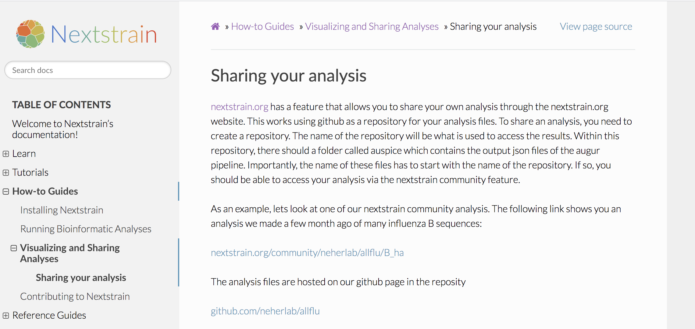
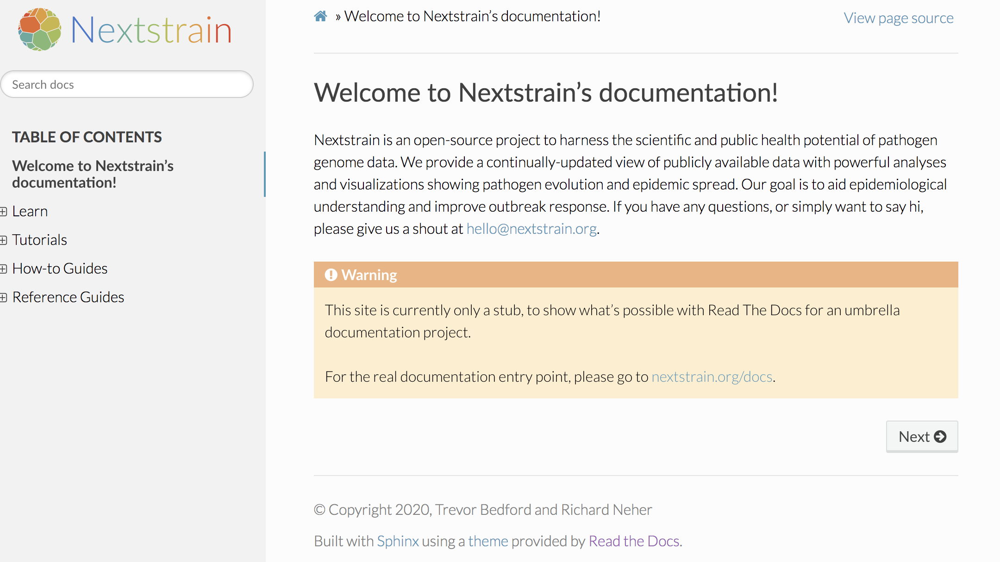

# docs.nextstrain.org

A prototype umbrella documentation project for Nextstrain, hosted at [docs.nextstrain.org](https://docs.nextstrain.org), using:

- [Read The Docs](https://readthedocs.org)
- [Sphinx](http://sphinx-doc.org)
- [Markdown](https://markdownguide.org) and [reStructuredText](https://docutils.sourceforge.io/rst.html) ([quick ref](https://docutils.sourceforge.io/docs/user/rst/quickref.html), [quicker ref](https://simonwillison.net/2018/Aug/25/restructuredtext/))
- [Subprojects](https://docs.readthedocs.io/en/stable/subprojects.html) for Augur and the CLI (plus maybe Auspice and other component/build-specific documentation in the future)
- Our custom [Sphinx theme](https://github.com/nextstrain/sphinx-theme) to provide consistent, branded styling.

## Domain / hosting management
To manage the hosting settings of docs.nextstrain.org and monitor automated builds triggered by pushes to this repository, go to https://readthedocs.org/projects/nextstrain/.
You'll need to create an account and be granted permissions to view and edit admin settings for the project by someone on the Nextstrain team.

## Building the docs

Build dependencies are managed with [Conda](https://conda.io).
Install them
into an isolated environment named `docs.nextstrain.org` with:

    conda env create

Enter the environment with:

    conda activate docs.nextstrain.org

You can now build the documentation with:

    make html

which invokes Sphinx to build static HTML pages in `build/html/`.
You can view them by running:

    open build/html/index.html

Leave the environment with:

    conda deactivate

### Build configuration

Read The Docs is configured via `readthedocs.yml`; [more about Read The Docs configuration](https://docs.readthedocs.io/en/stable/config-file/v2.html)

Sphinx is configured via `src/conf.py`; [more about Sphinx configuration](https://www.sphinx-doc.org/en/master/usage/configuration.html)

## Migration of Nextstrain docs to this repository
We have agreed on some major headings and subheadings [1] for an all-Nextstrain documentation project in this repo.
We are using the migrate branch to move individual documents over to this Read the Docs project, under those headings.
We are tracking progress of migration-related tasks in a github project [2].
[1] https://docs.google.com/document/d/1hq6hjukg3Pw8m12Y0IaephQYJCFvpFrChl0K0B_4UrQ/edit#heading=h.t0j8btmy5ggi
[2] https://github.com/nextstrain/docs.nextstrain.org/projects/1

## Implementation

### Document Formats

#### Markdown
Documents which don't need to include special table of contents or similar statements can be written in Markdown.

[Markdown formatting reference](https://www.markdownguide.org/basic-syntax/).

#### reStructuredText
There are some set of special features of Sphinx / Read The Docs which require using reStructuredText, such as creating sidebar / table of contents entries with `toctree` statements (see [File Hierarchy](#file-hierarchy)).

[reStructuredText formatting reference](https://www.sphinx-doc.org/en/master/usage/restructuredtext/basics.html).

### File Hierarchy
The hierarchy of the table of contents as seen in the sidebar can be thought of as a tree of documents.
The root is `src/index.rst` a reStructuredText (see [Restructured Text](#restructured-text)) file which dictates what the top-level headings in the sidebar will be.
It contains a `.. toctree::` "directive" or statement, followed by some configuration and then a list of file paths:
```
======================================
Welcome to Nextstrain's documentation!
======================================

Nextstrain is an open-source project to harness the scientific and public health potential of pathogen genome data.
We provide a continually-updated view of publicly available data with powerful analyses and visualizations showing pathogen evolution and epidemic spread.
Our goal is to aid epidemiological understanding and improve outbreak response.
If you have any questions, or simply want to say hi, please give us a shout at hello@nextstrain.org.

.. warning::
   This site is currently only a stub, to show what's possible with Read The Docs for an umbrella documentation project.

   For the real documentation entry point, please go to `nextstrain.org/docs <https://nextstrain.org/docs>`__.

.. toctree::
   :maxdepth: 2
   :titlesonly:
   :caption: Table of contents

   self
   learn/index
   tutorials/index
   guides/index
   reference/index
```
These file paths such as `learn/index` are what show up in the sidebar at the top level.
In this case, each of the paths specified is another reStructuredText(.rst - but the file extension is omitted in the `toctree` listing) file, containing a similar statement, listing the files for that section.
However, you can also list paths to regular markdown documents (also without extension) which will just render a clickable entry in the sidebar to navigate to that document, and it will not be an expandable section.
If any file contains a valid one of these `.. toctree::` statements, it will be rendered as an expandable heading in the sidebar, with the `toctree` entries rendered under that heading.

More on this in the [Sphinx Documentation](https://www.sphinx-doc.org/en/1.5/markup/toctree.html).

### Subprojects
[Subprojects](https://docs.readthedocs.io/en/stable/subprojects.html) are a way to nest Read The Docs projects.
To link to a file in a subproject (or any other Read The Docs project), use [intershpinx](https://docs.readthedocs.io/en/stable/guides/intersphinx.html), e.g.:
```diff
 ======================================
 Welcome to Nextstrain's documentation!
 ======================================
 
 Projects
 ========
 
+* :doc:`augur:index`
```
You also need to add the project you are linking to to the [intersphinx configuration](https://docs.readthedocs.io/en/stable/guides/intersphinx.html#using-intersphinx) of your build.

#### How we are currently using subprojects
Subprojects are how we keep documents in other repositories while still maintaining the versioning of those documents from their own repositories in a separate Read The Docs project.
Documents which we've kept in subprojects, as opposed to including them in this project, are specific reference material for those projects / repositories such as API documentation for augur.
It is our impression so far that subprojects necessitate a distinct domain name, such as https://docs.nextstrain.org/projects/augur as opposed to just https://docs.nextstrain.org.
This means a distinct set of headings / links in the sidebar navigation, making navigating back tohttps://docs.nextstrain.org more difficult once you have navigated to a subproject.
Therefore, we've made non-reference-guide documents (which are not repo-specific and for which we don't need subproject versioning) accessible in this main project via git submodules - so they still live in their respective repositories, but they are more accessible without having to know that one needs to find them in a particular repo's subproject.

This setup may be ignorant of a "best of both worlds" solution, which would allow us to version documents in subprojects according to their own repositories, and also include them in this project's domain and table of contents without having to navigate to a separate project to view them.

### Submodules
In many cases this will involve moving the document so that it is stored in this repository and adding the necessary Read the Docs directive to the document to surface the document in the table of contents / in the sidebar.
In some other cases, where it makes more sense to store the document in a different repository, we will need to include the document directly from it's home repository; the current plan for this is using submodules - see the following section for details on how to do this.

### How we use submodules to source documents from other repositories

1. Make sure you are on the latest `migrate` branch: `git clone https://github.com/nextstrain/docs.nextstrain.org.git && cd docs.nextstrain.org && git checkout migrate`
2. Fetch any existing submodules `submodule update --init --recursive`
3. Change to the `src` directory and add the submodule for the repository from which you would like to include document(s), e.g. `cd src && git submodule add https://github.com/nextstrain/augur.git`
4. Add the submodule to `readthedocs.yml`, e.g.:
```diff
 ---
 version: 2
 conda:
   environment: environment.yml
 submodules:
   include:
      - src/ncov
+     - src/augur
```
5. Now you may include any document from your submodule directory, `src/augur` by including the relative path to the document in a table of contents specification in a reStructuredText file like `src/guides/share/index.rst`:
```diff
 ======================================
 Visualizing and Sharing Analyses
 ======================================
 
 How-to guides for visualizing and sharing Nextstrain analyses.
 
 .. toctree::
    :maxdepth: 2
    :titlesonly:
    :caption: Table of contents
 
+   ../../augur/docs/faq/community_hosting
```
6. After building the docs (see above section), the `/guides/share/` section should include the document from the submodule in its table of contents: 

Here is another example of using submodules to achieve this goal in this repository: https://github.com/nextstrain/docs.nextstrain.org/pull/2/files#

7. From this point, we will need to update the commit referenced by the submodule-hosted document to ensure the version in this documentation doesn't become out of sync with the latest version in its home repository.
In the future, we will set up bots to create automatic pull requests when this happens that we can review and merge, but for now you need to update the submodule using git on the command line; see this document for an illustration of how that works https://git-scm.com/book/en/v2/Git-Tools-Submodules#_working_on_a_project_with_submodules.

## Contributing

### How to add a document
1. What [type of document](#types-of-documents) is it? This will help write it with a clear goal in mind.
2. Where should it go in the table of contents? See the Table of Contents at https://docs.nextstrain.org/en/migrate/ to find a heading that fits the document best.
3. Once the document is written, move it to the [directory](https://github.com/nextstrain/docs.nextstrain.org/tree/migrate/src) corresponding to the heading under which you'd like to to appear, e.g.:
```
mv sharing-data.md src/guides/share/
```
4. Add a relative path to the document file to a [`toctree`](#file-hierarchy), e.g.:
```diff
 ======================================
 Visualizing and Sharing Analyses
 ======================================
 
 How-to guides for visualizing and sharing Nextstrain analyses.
 
 .. toctree::
    :maxdepth: 2
    :titlesonly:
    :caption: Table of contents
 
    community-builds
    Download data <download-data>
    nextstrain-groups
+   sharing-data
```
5. [Build the docs](#building-the-docs) to see it rendered, and make any necessary edits before pushing to this repo.

### How-to tips
If you come across a useful feature to solve a common problem in the docs implementation, add it here!

#### Hide table of contents; only display in the sidebar
Adding the following line to the table of contents statement in the index / root page of this project, for example, will remove the table of contents section from that document and only render the table of contents in the navigation bar on the left like this:

```diff
.. toctree::
   :maxdepth: 2
   :titlesonly:
   :hidden:
   :caption: Table of contents

   self
   learn/index
   tutorials/index
   guides/index
   reference/index
```




## Types of documents
In terms of the content of a given document, we aim to classify documents according to the [Documentation System](https://documentation.divio.com/).
The Documentation System makes clear the distinction between motivations for different types of docs.
It advocates for a balance of content from these distinct categories for more useful docs experience by doc readers and a more well-defined task for doc writers.
Explicitly spelling out this breakdown in the docs themselves is recommended to make choosing the right document for a given question more transparent.

The types of documents are:
- [Tutorials](https://documentation.divio.com/tutorials/) - learning-oriented
- [How-to guides](https://documentation.divio.com/how-to-guides/) - problem- / goal- oriented
- [Reference guides](https://documentation.divio.com/reference/) - information-oriented
- [Explanation](https://documentation.divio.com/explanation/) (aka discussions) - understanding oriented

