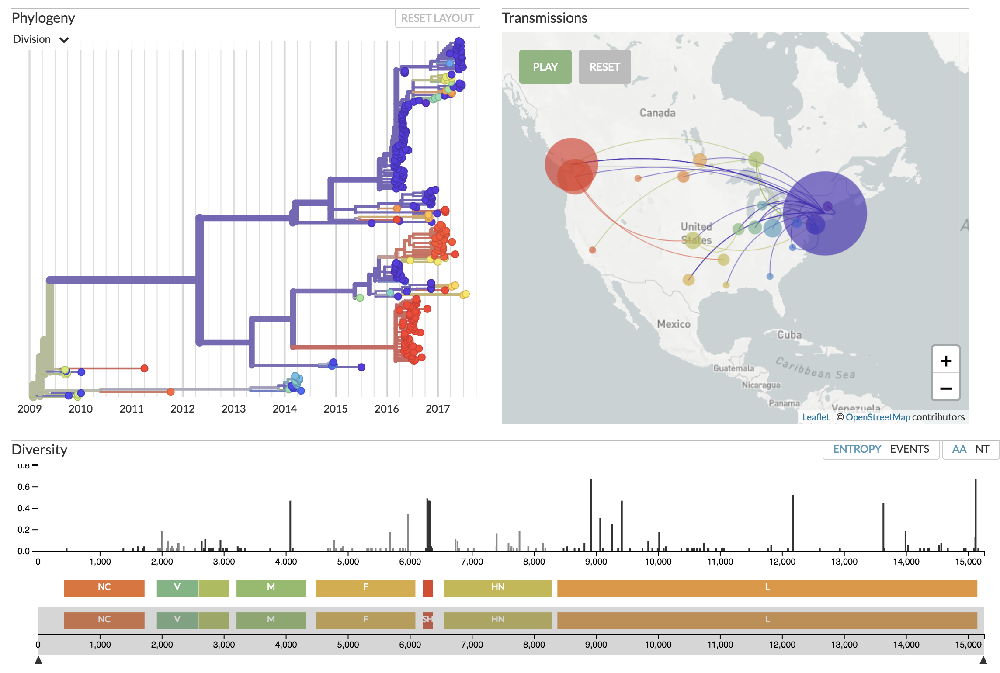

# Interacting with Nextstrain's phylogeographic visualisations

Visualization of bioinformatics results is an integral part of phylodynamics, both for data exploration and communication.
We wanted to build a tool that was highly interactive, versatile, and usable as a communication platform to quickly disseminate results to the wider community.
Auspice is written in JavaScript and is the app that powers all the phylogenomic analysis on nextstrain.org. The code is completely open-source and may be found on [Github](https://www.github.com/nextstrain/auspice)).

> This section is in need of work!
If you are able to, we'd really appreciate contributions to improve the content here (or anywhere else in the docs).
Please see [this page](../../guides/contribute/documentation) for how you can help.

*Auspice displaying mumps genomes from North America. See [nextstrain.org/mumps/na](https://www.nextstrain.org/mumps/na)*

### General Design Overview
We wanted to build a powerful, yet not overly complex visualization tool.
Currently this is centered around a number of "panels".
These allow us to display relationships between isolates such as their phylogenetic relationships, putative transmissions on the map, and variability across the genome.
Color is used consistently throughout the app in order to link different panels.
The generator of the data controls which traits are able to be visualized. For instance, transmissions can be turned off if the data is not informative.
A number of controls are made available in a sidebar to control the time period viewed, the layout of the tree, etc.

We are currently working on allowing scientists to author custom narratives which describe the data, and control how the data is visualized as one progresses through the narrative.
See [here](https://nextstrain.github.io/auspice/narratives/introduction) for more information.

