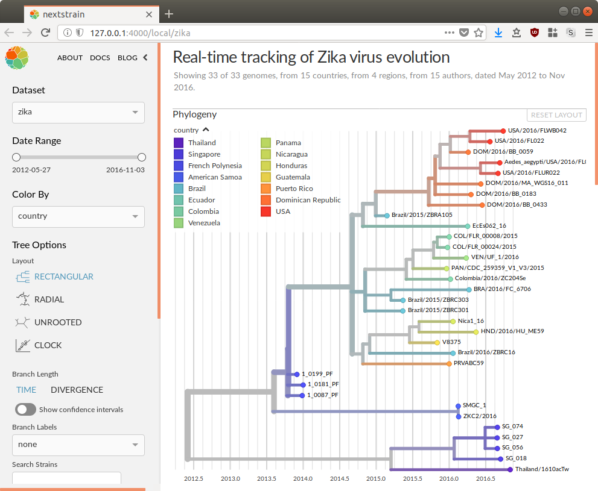

# Quickstart

This guide uses the [Nextstrain command-line interface (CLI) tool [GitHub]](https://github.com/nextstrain/cli) to help you get started running and viewing the pathogen builds you see on nextstrain.org.
It assumes you are comfortable using the command line and installing software on your computer.
If you need help when following this guide, please reach out by [emailing us](mailto:hello@nextstrain.org?subject=Quickstart%20help), or create a post at [discussion.nextstrain.org](https://discussion.nextstrain.org).

When you're done following this guide, you will have built a local version of [our example Zika analysis](https://github.com/nextstrain/zika-tutorial) and viewed the results on your computer.
You'll have a basic understanding of how to run builds for other pathogens and a foundation for understanding the Nextstrain ecosystem in more depth.

#### Further information:
* If you'd like to run these analysis in a more hands-on manner, without installing docker or the nextstrain CLI, read about [the difference between a local and container installation](../guides/install/index) and [how to install Augur & Auspice locally](../guides/install/local-installation).
You can then run the [Zika tutorial](./zika).
* Confused about what exactly a "pathogen build" is? [See here](https://docs.nextstrain.org/projects/augur/en/migrate-docs/faq/what-is-a-build.html).

#### Table of Contents:
* [Set up your computer](#set-up-your-computer)
* [Download the nextstrain/zika-tutorial repository](#download-the-nextstrain-zika-tutorial-repository)
* [Run the build](#run-the-build)
* [Visualize build results](#visualize-build-results)
* [Next Steps](#next-steps)

---

## Set up your computer

Before you can do anything else, you need to set up your computer to run the Nextstrain CLI.

### Install Python 3

Python 3.5 or higher is required.
There are many ways to install Python 3 on Windows, macOS, or Linux, including the [official packages](https://www.python.org/downloads/), [Homebrew](https://brew.sh) for macOS, and [Conda](https://www.anaconda.com/distribution/).
Details are beyond the scope of this guide, but make sure you install Python 3.5 or higher.

You may already have Python 3 installed, especially if you're on Linux.  Check by running `python3 --version`:

    $ python3 --version
    Python 3.6.5

### Install the Nextstrain CLI

With Python 3 installed, you can use [pip](https://pip.pypa.io) to install the [nextstrain-cli package](https://pypi.org/project/nextstrain-cli):

    $ python3 -m pip install nextstrain-cli
    Collecting nextstrain-cli
    […a lot of output…]
    Successfully installed nextstrain-cli-1.4.1

After installation, make sure the `nextstrain` command works by running `nextstrain version`:

    $ nextstrain version
    nextstrain.cli 1.4.1

_The version you get will probably be different than the one shown in the
example above_.

### Install Docker Community Edition (CE)

The Nextstrain CLI tool currently requires [Docker](https://docker.com), which is freely available.
On Windows or a Mac you should download and install [Docker Desktop](https://www.docker.com/products/docker-desktop) (also known as "Docker for Mac" and "Docker for Windows").
On Linux, your package manager should include a Docker package.

After installing Docker, run `nextstrain check-setup` to ensure it works:

    $ nextstrain check-setup
    nextstrain-cli is up to date!

    Testing your setup…

    ✔ docker is installed
    ✔ docker run works

    All good!

If the final message doesn't indicate success (as with "All good!" in the example above), something may be wrong with your Docker installation.

### Download the Nextstrain environment image

The final part of the set up is running `nextstrain update` to download the latest [Nextstrain environment image](https://github.com/nextstrain/docker-base) used by the CLI:

    $ nextstrain update
    nextstrain-cli is up to date!

    Updating Docker image nextstrain/base…
    […a lot of output…]
    Your images are up to date!

You can re-run this command in the future to get updates to the Nextstrain environment.

### Optional: Install git

[git](https://en.wikipedia.org/wiki/Git_(software)) is a [version control system](https://git-scm.com/book/en/v2/Getting-Started-About-Version-Control) used by all of the Nextstrain ecosystem.
It is free to [download and install git](https://git-scm.com/book/en/v2/Getting-Started-Installing-Git).

While git is not required to use this guide, it is recommended and _will_ be necessary for taking the next steps after this guide.

---
## Download the nextstrain/zika-tutorial repository

Now that you're set up, it's time to download the [example Zika pathogen repository](https://github.com/nextstrain/zika-tutorial) you're going to build.

If you have git installed, clone the repository we use to keep track of changes to our analysis:

    $ git clone https://github.com/nextstrain/zika-tutorial
    Cloning into 'zika-tutorial'...
    […more output…]

When it's done, you'll have a new directory called `zika-tutorial/`.

If you don't have git installed and want to skip installing it for now, you can instead download [a snapshot of the repository in a zip file](https://github.com/nextstrain/zika-tutorial/archive/master.zip).
After unzipping the snapshot, you'll need to rename the resulting `zika-tutorial-master/` directory to just `zika-tutorial/` to match the rest of this guide.

---
## Run the build

Nextstrain builds use the [Augur bioinformatics toolkit](https://docs.nextstrain.org/projects/augur/en/migrate-docs/index.html) to subsample data, align sequences, build a phylogeny, estimate phylogeographic patterns, and save the results in a format suitable for [visualization with Auspice](https://docs.nextstrain.org/projects/auspice/en/migrate-docs/).

Run `nextstrain build --cpus 1 zika-tutorial/` to run the build:

    $ nextstrain build --cpus 1 zika-tutorial/
    Building DAG of jobs...
    […a lot of output…]

This should take just a few minutes to complete.
In order to save time, the tutorial build uses an example data set which is quite a bit smaller than [our live Zika analysis](https://nextstrain.org/zika).

Output files will be in the directories `zika-tutorial/data/`, `zika-tutorial/results/` and `zika-tutorial/auspice/`.

---
## Visualize build results

Now you can run `nextstrain view zika-tutorial/auspice/` to view the build results using Nextstrain's visualizations:

    $ nextstrain view zika-tutorial/auspice/
    ——————————————————————————————————————————————————————————————————————————————
        The following datasets should be available in a moment:
           • http://127.0.0.1:4000/local/zika
    ——————————————————————————————————————————————————————————————————————————————
    […more output…]

[Open the link shown](http://127.0.0.1:4000/local/zika) in your browser.

---
## Next steps

* Learn more [about the Zika build](./zika) or the [Tuberculosis build](tb_tutorial).

* Learn more about the CLI by running `nextstrain --help` and `nextstrain <command> --help`.

* Explore the Nextstrain environment by running ad-hoc commands inside it using `nextstrain shell zika/`.

* Read about [the difference between a local and container installation](../guides/install/index).

